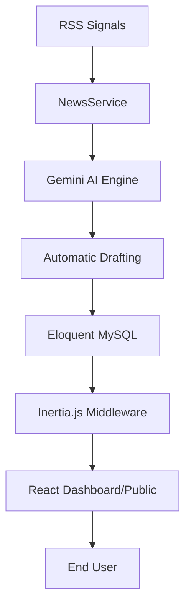

# ⚡️ Techy News — The Intelligence Pipeline

[](https://laravel.com)
[](https://reactjs.org)
[](https://deepmind.google/technologies/gemini/)
[](https://vitejs.dev)

> A cutting-edge, AI-powered journalism platform prototype that redefines information consumption through deep technical research and automated synthesis.

**[Explore the Live Platform →](https://techynews.lat)**

---

## 🚀 The Vision

Techy News isn't just a CMS; it's a **living intelligence ecosystem**. It aggregates global tech signals, processes them through advanced LLMs, and delivers deeply researched, developer-first narratives in real-time. Built with a focus on extreme performance, sophisticated typography, and multi-modal interaction.

## ✨ Core Features

### 🤖 The Intelligence Pipeline
- **Automated Synthesis**: Aggregates global tech data signals to generate opinionated, 1500-word investigative drafts.
- **On-the-fly Translation**: Seamlessly translates complex technical content into English, Spanish, and Portuguese while preserving semantic integrity and code blocks.
- **Semantic Search**: Instant command-palette discovery (Cmd+K) powered by Eloquent and filtered by AI relevance.

### 🎨 Modern Experience
- **Fluid UI**: Framer Motion powered transitions and a bespoke Bento-grid architecture.
- **Theme Intelligence**: Deeply integrated Dark/Light mode with automatic system detection.
- **Developer-First Design**: Native syntax highlighting (Prism.js), Mermaid.js diagrams, and JetBrains Mono typography.
- **Mobile Optimized**: Fully responsive hamburger navigation and touch-optimized reading experiences.

### 🛠 Technical Excellence
- **Laravel 13 Core**: Leveraging the latest PHP 8.2+ features and high-performance routing.
- **Inertia.js + React**: Seamless SSR-like feel with the power of modern client-side components.
- **Intelligent Caching**: Layered caching strategy (1hr articles, 24hr briefs) to minimize API latency.
- **Raw HTML Engine**: Content is stored and rendered as raw semantic HTML, bypassing slow markdown parsers.

---

## 📦 Installation & Setup

### Prerequisites
- PHP 8.2+
- Node.js 20+
- MySQL 8.0+
- Gemini API Key (Google AI Studio)

### Steps
1. **Clone the repository**
   ```bash
   git clone https://github.com/carlos-silveira/techy-laravel.git
   cd techy-laravel
   ```

2. **Backend Setup**
   ```bash
   composer install
   cp .env.example .env
   php artisan key:generate
   php artisan migrate --seed
   ```

3. **Frontend Setup**
   ```bash
   npm install
   npm run build
   ```

4. **Environment Configuration**
   Ensure your `.env` includes:
   ```env
   GEMINI_API_KEY=your_api_key_here
   GEMINI_MODEL=gemini-2.0-flash
   ```

5. **Start the Engine**
   ```bash
   php artisan serve
   ```

---

## 🏛 Architecture



Detailed technical documentation can be found in the [`/docs`](/docs) directory:
- [System Design Document (SDD)](/docs/SDD.md)
- [AI Coding Guide](/docs/AI_CODING_GUIDE.md)
- [Deployment Workflow](/docs/workflows/deploy.md)

---

## 👤 Author

**Carlos Silveira**  
*Senior Software Engineer & AI Architect*

- [GitHub](https://github.com/carlos-silveira)
- [LinkedIn](https://linkedin.com/in/carlos-silveira-hinojos)
- [Portfolio](https://techynews.lat/about)

---

## 📄 License

This project is open-source software licensed under the [MIT license](LICENSE).
